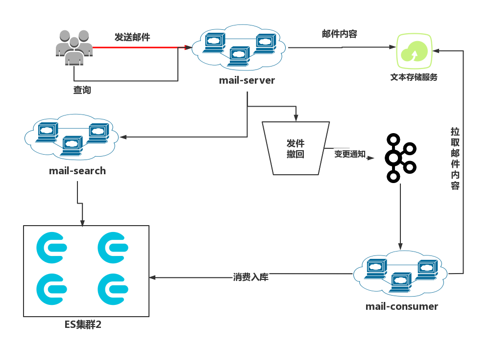

<p align="center">
  
  <h3 align="center">mail-server</h3>
  <p align="center">mail-server 是一款极易搭建的自助邮件服务。</p>
</p>


---
## 项目愿景

mail-server项目旨在打造一个以最简便的方式搭建简单、稳定的邮件服务。使用 Go 语言开发使得 imail 能够通过独立的二进制分发，并且支持 Go 语言支持的 所有平台，包括 Linux、macOS、Windows 以及 ARM 平台。

- 支持多域名管理。
- 邮件草稿功能支持。
- 邮件搜索功能支持。
- Rspamd垃圾邮件过滤支持。
- Hook脚本支持。

## 环境要求
- go >= 1.15
- MySQL >= 5.7
- redis >=4.0.0
- elasticsearch >= 7.0

## 环境配置
```shell
设置GOPROXY和GOPRIVATE
GOPROXY=https://goproxy.cn;GOPRIVATE=*gitee.com
```
## 启动方式
```shell
 go run main.go service
```
也可以打包后运行，在项目根目录执行
```shell
go build
```
会在项目根目录生成编译好的可执行文件mail-server.exe
运行该文件即可
```shell
./mail-server.exe service
```

[](/screenshot/运行截图.png)


邮件服务整体架构

[](/screenshot/邮件服务整体架构.png)

[](https://github.com/phper95/mail-server/actions/workflows/go.yml)
[](https://github.com/phper95/mail-server/actions/workflows/codeql-analysis.yml)
[](https://codecov.io/gh/phper95/mail-server)

## 版本截图

[](/screenshot/main.png)


## 授权许可

本项目采用 MIT 开源授权许可证，完整的授权说明已放置在 [LICENSE](https://gitee.com/phper95/mail-server/blob/master/LICENSE) 文件中。

